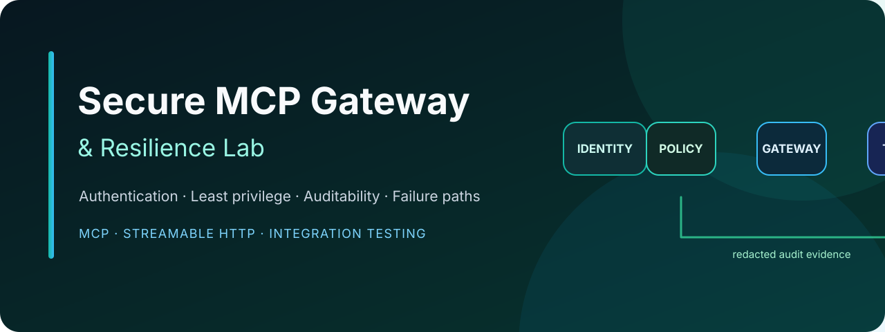

<p align="center">
  
</p>

<p align="center">
  
  
  
  
</p>

# Secure MCP Gateway & Resilience Lab

> Built by a Senior QA Automation Engineer exploring reliable and secure AI-agent testing.

A sanitized TypeScript portfolio project that shows how I test explicit security and reliability boundaries around MCP tools exposed through Streamable HTTP.

## Recruiter snapshot

This lab demonstrates practical **QA Automation**, **API/integration testing**, and **AI-agent security testing** in TypeScript:

| Area | Evidence in this repository |
| --- | --- |
| MCP and API integration | A real MCP client connects to the Streamable HTTP gateway, discovers tools, and invokes them in an integration test. |
| Authorization testing | A read-only identity can read inventory but is denied when it attempts to create a restock draft. |
| Security controls | Bearer authentication, per-tool scopes, host validation, rate limiting, input validation, and redacted audit events. |
| Safe agent actions | The only write-capable tool creates a draft; a human approval step remains outside the tool surface. |

The point is not merely to make an MCP tool callable. It is to produce evidence that identities, permissions, failure paths, and audit data behave safely.

## What I am testing

- Authentication is enforced before an MCP request reaches a tool.
- Least-privilege authorization is enforced independently for each tool.
- A denied action is observable without writing credentials or personal data to audit logs.
- Negative and abuse cases receive the same attention as the happy path.

## Architecture

```text
MCP client
   │
   ▼
Host validation → Bearer auth → Rate limit → MCP transport
                                              │
                         ┌────────────────────┴───────────────────┐
                         ▼                                        ▼
              get_inventory                              create_restock_draft
              inventory:read                             restock:draft
                         │                                        │
                         └──────── redacted audit events ─────────┘
```

## Security and reliability controls

- localhost host-header validation to reduce DNS-rebinding risk;
- bearer-token authentication with hashed, timing-safe comparison;
- per-tool scopes and least privilege;
- fixed-window per-subject rate limiting;
- Zod input schemas;
- structured audit logging with recursive redaction;
- draft-only write behavior with human approval;
- sanitized unit and MCP integration tests.

## Test strategy

| Test layer | What it proves |
| --- | --- |
| Unit tests | Token authorization does not expose the token; sensitive fields are redacted before audit persistence; the rate limiter is available to middleware. |
| MCP integration tests | An unauthenticated MCP initialization receives `401`; an authenticated read-only client can use `get_inventory` but cannot use `create_restock_draft`. |

The integration suite starts the actual local HTTP gateway and connects through the MCP client SDK. This tests the security boundary across transport, authentication, authorization, and tool invocation rather than testing isolated functions only.

## Run the test suite

```bash
npm install
npm run test:all
```

To run the local gateway:

```bash
export MCP_READER_TOKEN='local-reader-value'
export MCP_OPERATOR_TOKEN='local-operator-value'
npm start
```

The endpoint is `http://127.0.0.1:3200/mcp` by default.

See [the threat model](docs/threat-model.md) for the assets, threats, mitigations, and known limitations.

## Not production-ready

This lab deliberately uses local opaque tokens and an in-memory rate limiter. Production deployments should use OAuth/OIDC, TLS, audience validation, token rotation, distributed rate limiting, durable audit storage, and operational monitoring.

## Sanitization

All inventory records, identities, tokens, and events are synthetic. Never add production credentials, private endpoints, customer data, internal threat reports, or employer configuration.
